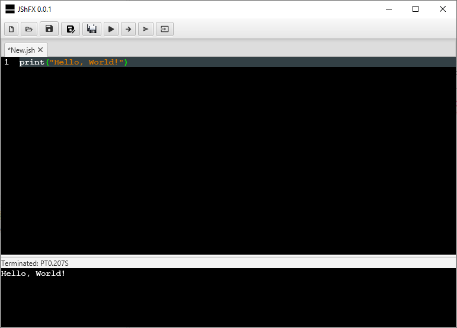

# JShFX
## About
JShFX is a GUI Java shell developed with JavaFX a JShell API. 

## Download, Installation and Start
The binary files can be downloaded from:

[Releases](https://github.com/appsofteng/jshfx/releases)

### Windows x64
Unzip the downloaded file and from the extracted directory run 

`start.bat` 

### Linux and macOS x64
Extract the file, e.g. to the /opt directory:

`tar zxvf jshfx-0.0.1-linux-x64.tgz -C /opt` 

`tar zxvf jshfx-0.0.1-mac-x64.tgz -C /opt` 

then from the extracted directory run

`start.sh`

## Dependencies
This project depends on the following libraries and their dependencies:

- [OpenJDK](https://jdk.java.net)
- [OpenJFX](https://openjfx.io)
- [RichTextFX](https://github.com/FXMisc/RichTextFX)
- [ControlsFX](https://github.com/controlsfx/controlsfx)
- [Picocli](https://picocli.info)
- [Meven Resolver](https://maven.apache.org/resolver)
- [Yasson](https://github.com/eclipse-ee4j/yasson)
